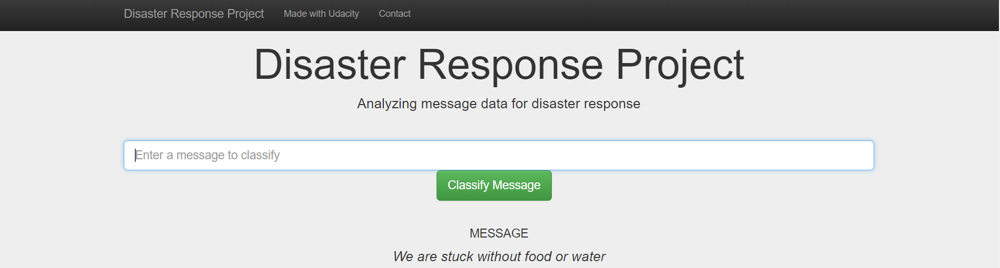

# Disaster-Response-Pipelines
### Disaster Response Pipeline Project
## Table of Contents
1. [Description](#description)
2. [Requirements](#requirements)
3. [Executing Program](#executing)
4. [Materials](#materials)
4. [Acknowledgement](#acknowledgement)
6. [Screenshots](#screenshots)

## Description
This project is a part of Udacity DataScience Nano degree program to classify disaster response messages through machine learning
The initial data set contains real messages pre-labelled tweet and real messages that were sent during disaster events.
The aim of the project was to create a machine learning pipeline which categorizes these events so that they can be send to an appropriate disaster relief agency.

## Requirements
* Python 3.5+
* Machine Learning Libraries: NumPy, SciPy, Pandas, Sciki-Learn
* Natural Language Process Libraries: NLTK
* SQLlite Database Libraqries: SQLalchemy
* Model Loading and Saving Library: Pickle
* Web App and Data Visualization: Flask, Plotly

## Executing Program
1. Run the following commands in the project's root directory to set up your database and model.
    - To run ETL pipeline that cleans data and stores in database
        `python data/process_data.py data/disaster_messages.csv data/disaster_categories.csv data/DisasterResponse.db`
    - To run ML pipeline that trains classifier and saves
        `python models/train_classifier.py data/DisasterResponse.db models/classifier.pkl`
2. Run the following command in the app's directory to run your web app.
    `python run.py`
3. Go to http://0.0.0.0:3001/

## Materials
In the **data** and **models** folder you can find everything that is required to help you understand how the model works and how to run it:
1. **ETL Preparation Notebook**: Notebook containing ETL pipeline
2. **ML Pipeline Preparation Notebook**: Notebook containing the Machine learning pipeline
3. **app/templates/***: templates/html files for web app
4. **data/process_data.py**: Extract Train Load (ETL) pipeline used for data cleaning, feature extraction, and storing data in a SQLite    database
5. **models/train_classifier.py**: A machine learning pipeline that loads data, trains a model, and saves the trained model as a .pkl      file for later use
6. **run.py**: This file can be used to launch the Flask web app used to classify disaster messages

## Acknowledgements
* [Udacity](https://www.udacity.com/) for providing such a wonderful project
* [Figure Eight](https://www.figure-eight.com/) for providing the datasets

## Screenshots
1. You can type a message to classify in the space provided. Example as shown below.

2. After clicking **Classify Message**, you can see the categories which the message belongs to highlighted in green

3. The main page shows some graphs about training dataset, provided by Figure Eight

